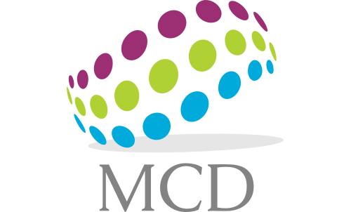

# Curso Herramientas de Productividad para Ciencia de Datos

## XXX Escuela Nacional de Optimización y Análisis Numérico

## Instructores

- **Juan Pablo Soto Barrera** (`juanpablo.soto@unison.mx`)

- **Julio Waissman Vilanova** (`julio.waissman@unison.mx`)

## Fechas

- Viernes 9 de abril de 19:00 a 21:00 hrs
- Sábado 10 de abril de 10:00 a 12:00 hrs 

### Página web

El curso (y el diplomado en general) se encuentra respaldado por la planta académica de la [Maestría en Ciencia de datos](https://mcd.unison.mx) del [Departamento de Matemáticas de la Universidad de Sonora](https://www.mat.uson.mx/web/)

