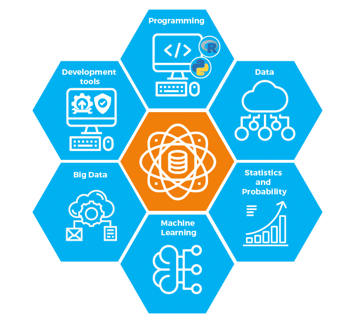
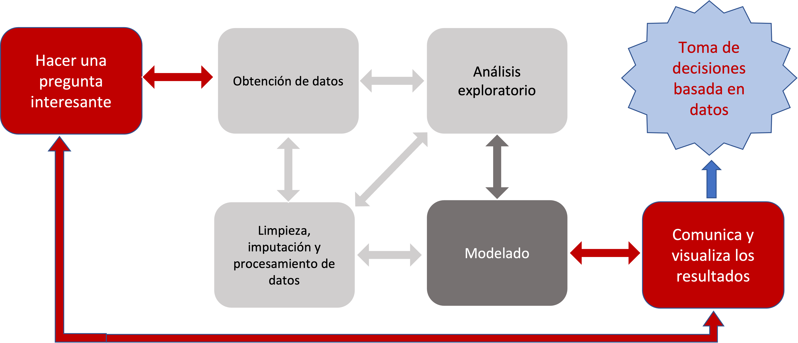
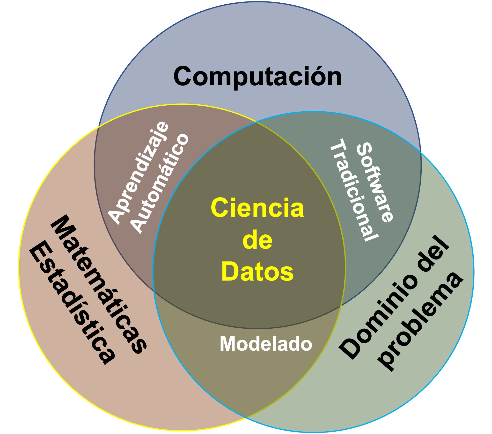

Herramientas de productividad para Ciencia de Datos

# **¿Porqué es importante conocer las herramientas?** 

Julio Waissman y Juan Pablo Soto

**XXX ENOAN, julio 2022**

https://mcd-unison.github.io/enoan2022-i3/

---

### ¿Qué es la ciencia de datos?

---

### ¿Quién hace Ciencia de Datos?

---

### ¿Porqué debemos conocer las herramientas básicas de productividad?

- Trabajo en equipos transdisciplinarios
- Reproducibilidad (en mi compu si funciona)
- Escalabilidad
- Uso de la Nube

---

### Qué vamos a ver

1. Docker (contenedores)
2. CLI (uso de la terminal y el shell de UNIX)
3. GIT y github (manejo de versiones)
4. Jupyter (investigación reproducible)

https://mcd-unison.github.io/enoan2022-i3/

---

### Qué no vamos a ver (entre muchas)

1. SQL
2. Manejo de grandes volumenes de datos
3. Plataformas integradas
4. R y RStudio

---

### Consideraciones

1. Vamos a tratar de ir rápido para alcanzar el temario
2. Página web del curso con material extra
3. Ligas y propuestas de cursos y ejercicios de aprendizaje

https://mcd-unison.github.io/enoan2022-i3/

